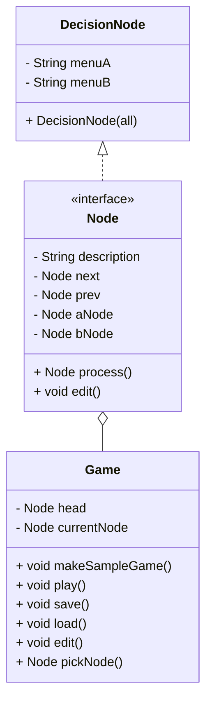

# CS121_Final_Project_Beck
## (lab) Final Project Proposal and UML

### UML Diagram

```mermaid
classDiagram
    class Node {
        <<interface>>
        - String description
        - Node next
        - Node prev
        - Node aNode
        - Node bNode
        + Node process()
        + void edit()
    }

    class Game {
        - Node head
        - Node currentNode
        + void makeSampleGame()
        + void play()
        + void save()
        + void load()
        + void edit()
        + Node pickNode()
    }

    class DecisionNode {
        - String menuA
        - String menuB
        + DecisionNode(all)
    }

    Node o-- Game
    DecisionNode <|.. Node
```